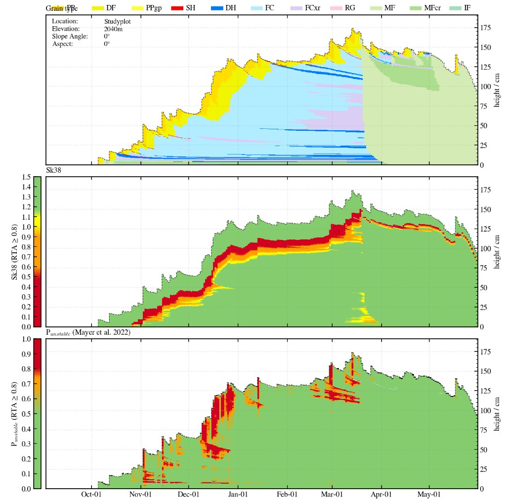
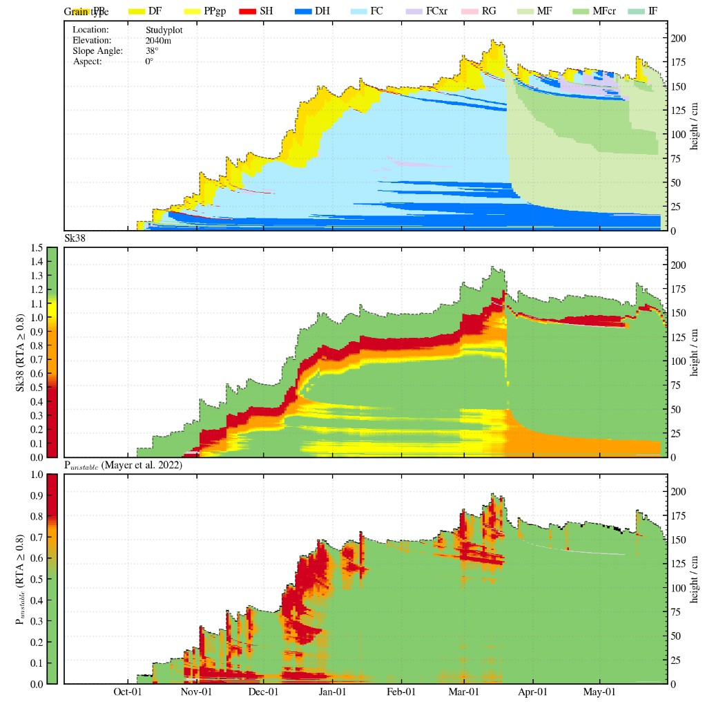
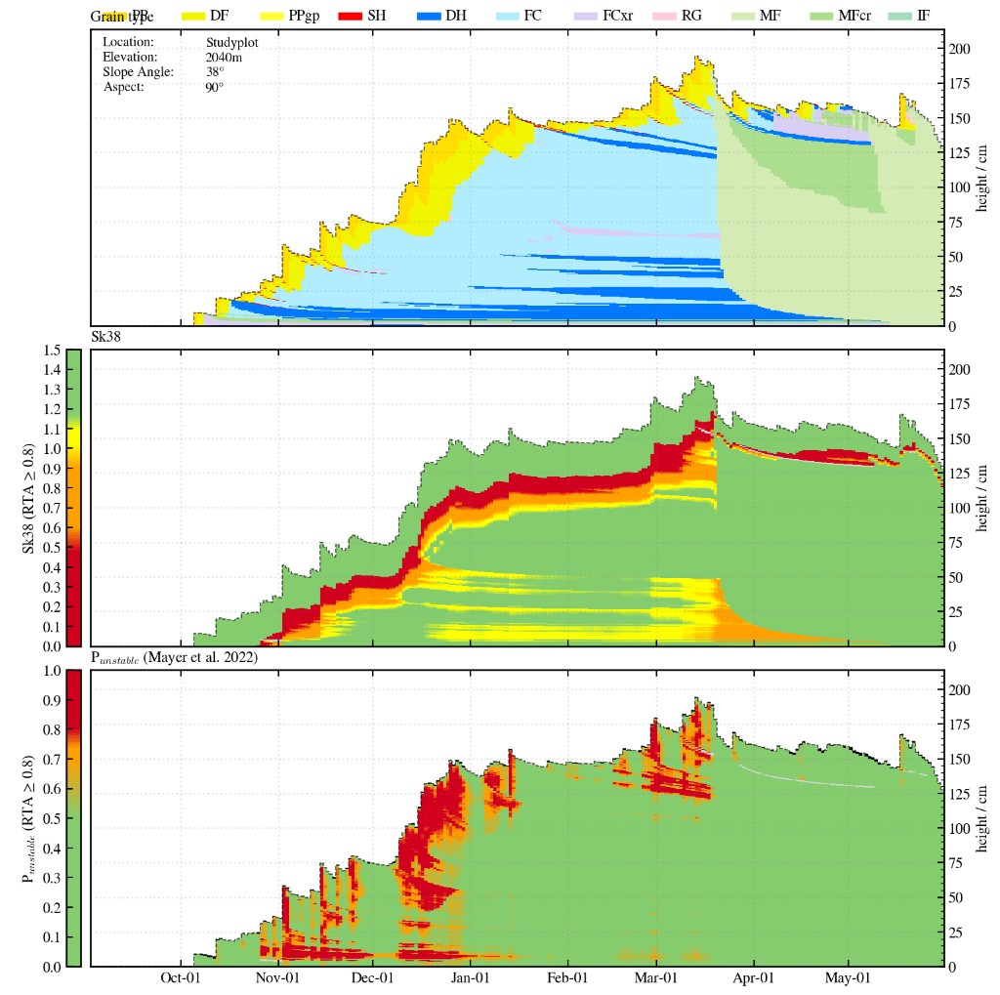
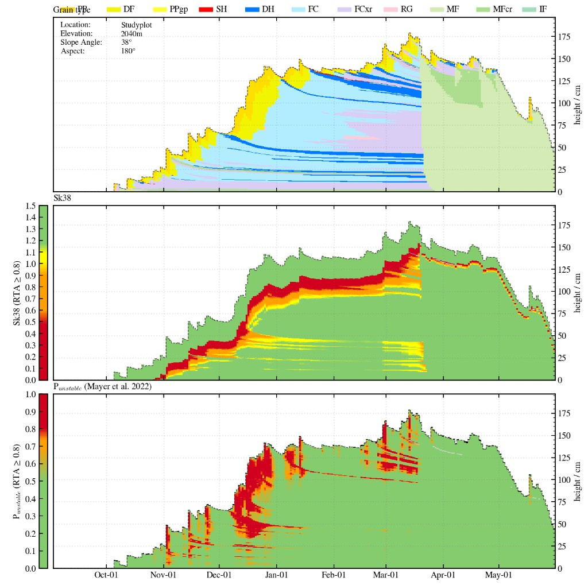
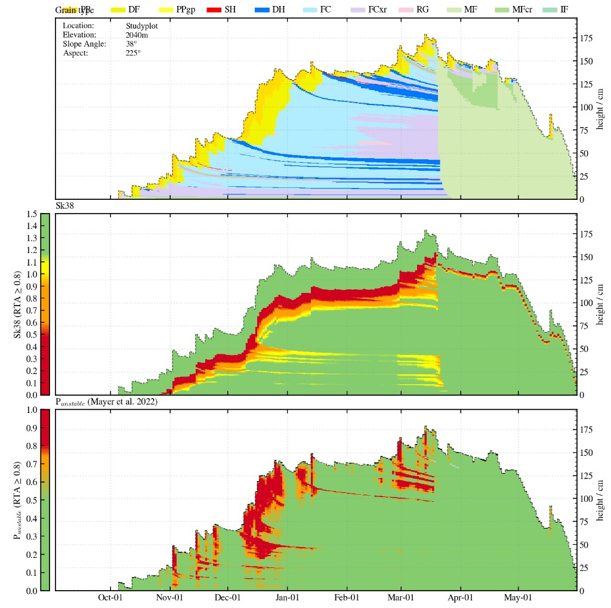
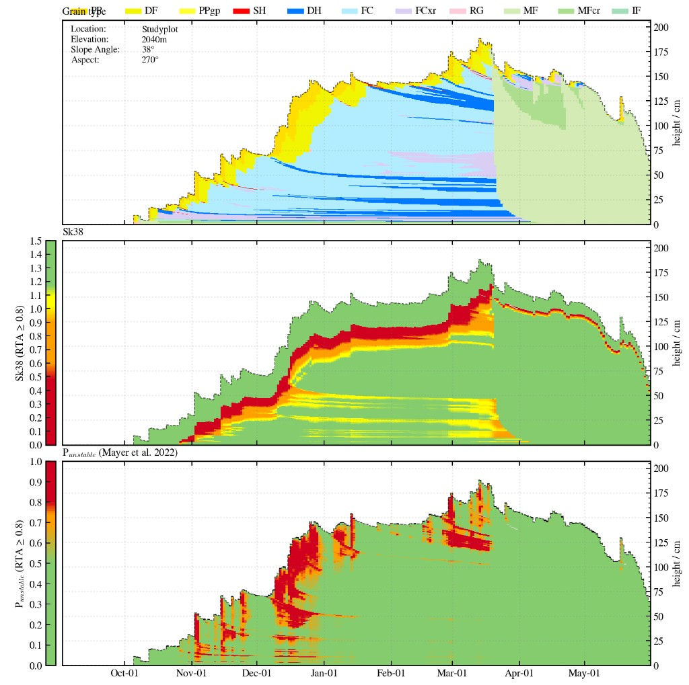
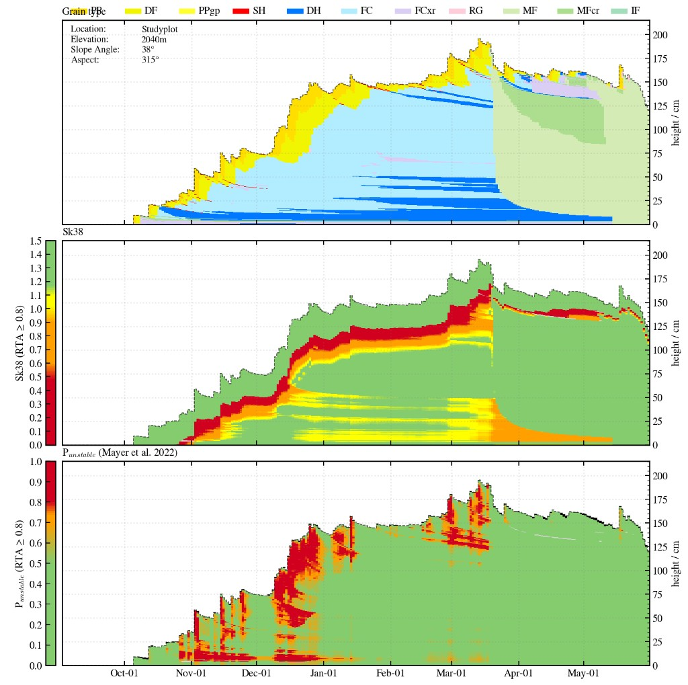

# Avapro Point Location

This project evaluates the use of physics-based snowpack simulations to automatically identify avalanche problems and support operational avalanche forecasting. Using the AvaPro algorithm with SNOWPACK simulations, the study compares algorithm-derived avalanche problems with expert hazard assessments and observed avalanche activity across four representative snow climates in western Canada under both weather-station-driven and fully numerical weather prediction forcing. The goal of this documentation is to summarize the project's development, methodology, preliminary findings, and ongoing progress throughout the research.

<div class="note-box" markdown="1">
<p class="note-box__title">Overleaf Paper Draft</p>
<div class="note-box__body">
<a href="https://www.overleaf.com/1521811837ybdtgdbhbyth#cb180e" target="_blank" rel="noopener">https://www.overleaf.com/1521811837ybdtgdbhbyth#cb180e</a>
</div>
</div>

## 1. Data

<p class="section-updated">Last updated: 15 Jul 2026</p>
### 1.1 Study Areas

<p class="section-updated">Last updated: 15 Jul 2026</p>
Study areas span four representative snow climates in western Canada:

- Whistler Blackcomb & Whistler Heliskiing
- Rogers Pass / Glacier National Park
- Banff National Park
- Mike Wiegele Heliskiing

Notebook link: [`/Users/machtl/Documents/Projects_PhD/maps_proposal/location_map.ipynb`](file:///Users/machtl/Documents/Projects_PhD/maps_proposal/location_map.ipynb)

<iframe class="map-frame" src="../assets/maps/overview_clipped.html" title="Study areas overview map" loading="lazy"></iframe>

<p class="fig-caption"><strong>Figure 1.</strong> Interactive overview map of the four study areas (Whistler Blackcomb & Whistler Heliskiing, Rogers Pass / Glacier National Park, Banff National Park, Mike Wiegele Heliskiing).</p>

#### 1.1.1 Meteo Data

<p class="section-updated">Last updated: 16 Jul 2026</p>

See the [HRDPS](../hrdps/) page for data handling and crushing (download, GRIB processing, and SMET conversion).

<p class="table-caption"><strong>Table 1.</strong> Meteo data sources and local paths used for AvaPro point-location runs.</p>

| Data | Path | Script / Documentation |
|------|------|------------------------|
| RAW HRDPS DATA | [`/Users/machtl/Documents/Projects_Data/FirAliance download/smet_output`](file:///Users/machtl/Documents/Projects_Data/FirAliance%20download/smet_output) | [HRDPS](../hrdps/) |
| HRDPS Downscaled Data | Path | [Local HRDPS to Single Location Elevation Corrected](../hrdps/#5-local-hrdps-to-single-location-elevation-corrected) |
| RAW Station data | `folderpath` | |
| Weather stations raw | Path | |
| Weatherstation patched | Path | |

### 1.2 Snowpack Simulations

<p class="section-updated">Last updated: 23 Jul 2026</p>

<div class="note-box">
<p class="note-box__title">Project Simulations Folder</p>
<div class="note-box__body">
<a href="file:///Users/machtl/Documents/Projects_PhD/SNP_runs_for_ISSW26">/Users/machtl/Documents/Projects_PhD/SNP_runs_for_ISSW26</a>
</div>
</div>

Snowpack is simulated at point locations with a physics-based model forced by:

1. **AWS** — observed station meteorology (temperature, humidity, wind, precipitation / snow height)
2. **HRDPS** — downscaled numerical weather prediction fields for the same points

Simulations produce the layered snowpack state (grain type, hardness, density, weak layers) that Avapro uses to flag avalanche problems over the season.

#### SNP Runs for ISSW26

SNOWPACK research runs for ISSW26. The **SNOWPACK binary stays** in the install tree (`snowpack_vGitMaster`); this repo holds configs, forcing (SMET), initial profiles (`.sno`), and outputs.

Default binary path used by the runners:

[`/Users/machtl/Documents/snowpack_vGitMaster/snowpack/bin/snowpack`](file:///Users/machtl/Documents/snowpack_vGitMaster/snowpack/bin/snowpack)

Override with `SNOWPACK_BIN=/path/to/snowpack` if needed.

##### Repo Structure

```text
SNP_runs_for_ISSW26/
├── config/
│   ├── snp_template_debug.ini          # shared defaults (IMPORT_BEFORE)
│   ├── snp_Rendezvous25_nwp.ini        # legacy 2025 site ini
│   ├── snp_Rendezvous26_nwp.ini        # legacy 2026 site ini
│   └── 2026/
│       ├── NWP_stations/               # one ini per station (main workflow)
│       │   ├── Whistler_Rendezvous_HRDPS_2026.ini
│       │   ├── Banff_Bowsumit_HRDPS_2026.ini
│       │   ├── MWHS_MtStAnn_HRDPS_2026.ini
│       │   └── Rogers_Fidelity_HRDPS_2026.ini
│       └── NWP_singleop/               # reserved for single-op setups
├── smet/
│   ├── 2025/                           # legacy forcing
│   └── 2026/
│       ├── NWP_stations/               # HRDPS station SMETs (*_1.smet)
│       └── NWP_singleop/               # regional ALP/BTL/TL SMETs
├── sno/
│   ├── 2025/
│   └── 2026/
│       ├── NWP_stations/               # flat + virtual slopes (*_1 … *_18)
│       └── NWP_singleop/
├── out/
│   └── 2026/
│       └── NWP_stations/               # .pro / .smet outputs
├── run_snowpack.sh                     # single-run wrapper (auto -e)
└── run_snowpack_all_stations_year.sh   # batch by year (all or one op)
```

**Layout idea:** `YEAR / EXPERIMENT / …` so paths stay parallel across `config`, `smet`, `sno`, and `out`.

##### How to Run

###### Single Operation

```bash
cd /Users/machtl/Documents/Projects_PhD/SNP_runs_for_ISSW26

# recommended: year + station batch helper
./run_snowpack_all_stations_year.sh 2026 Whistler_Rendezvous_HRDPS_2026

# or call the low-level runner with an ini path
./run_snowpack.sh config/2026/NWP_stations/Whistler_Rendezvous_HRDPS_2026.ini

# optional: override end date (default = last SMET timestamp)
./run_snowpack.sh config/2026/NWP_stations/Whistler_Rendezvous_HRDPS_2026.ini 2026-01-01T00:00:00
```

Short names work if unique, e.g. `./run_snowpack_all_stations_year.sh 2026 Fidelity`.

###### All Operations for a Year

```bash
./run_snowpack_all_stations_year.sh 2026 all
```

- Finds all `config/2026/**/*.ini` (excluding `*template*`)
- Runs up to **4 in parallel** (`NCORES=4` by default)
- Each job uses auto `-e` from the station SMET last row

```bash
NCORES=2 ./run_snowpack_all_stations_year.sh 2026 all
```

##### Required Input Files (Per Station)

Example station stem: `Whistler_Rendezvous_HRDPS_2026`  
Forcing / snow file stem: `Whistler_Rendezvous_HRDPS_2026_1`

<p class="table-caption"><strong>Table 1b.</strong> Required input files per station for SNP runs (ISSW26).</p>

| Role | Path / file | Notes |
|------|-------------|-------|
| Site ini | `config/2026/NWP_stations/<STEM>.ini` | Paths, `METEOFILE1`, `SNOWFILE1`, `NUMBER_SLOPES`, `EXPERIMENT` |
| Shared template | `config/snp_template_debug.ini` | Pulled via `IMPORT_BEFORE = ../../snp_template_debug.ini` |
| Forcing SMET | `smet/2026/NWP_stations/<STEM>_1.smet` | Hourly meteo; must include units |
| Flat `.sno` | `sno/2026/NWP_stations/<STEM>_1.sno` | Empty start profile; `ProfileDate` |
| Slope `.sno` | `sno/2026/NWP_stations/<STEM>_11` … `_18.sno` | Needed if `NUMBER_SLOPES = 9` |
| Output dir | `out/2026/NWP_stations/` | Created/used by ini `[Output] METEOPATH` |
| Binary | `…/snowpack/bin/snowpack` | Not in this repo |

##### Quick Checklist Before a Run

- [ ] Ini paths point to this repo (`smet` / `sno` / `out`)
- [ ] SMET has `units_offset` / `units_multiplier`
- [ ] Matching `.sno` set for `NUMBER_SLOPES`
- [ ] `METEOFILE1` + `SNOWFILE1` match file stems
- [ ] `EXPERIMENT` set if you want labeled outputs
- [ ] Binary path correct (`SNOWPACK_BIN` if not default)

#### 1.2.1 .pro Simulations for NWP Run

<p class="section-updated">Last updated: 23 Jul 2026</p>

NWP-station SNOWPACK outputs (`.pro` / `.smet`) live here:

<div class="note-box">
<p class="note-box__title">NWP Station Outputs</p>
<div class="note-box__body">
<a href="file:///Users/machtl/Documents/Projects_PhD/SNP_runs_for_ISSW26/out/2026/NWP_stations">/Users/machtl/Documents/Projects_PhD/SNP_runs_for_ISSW26/out/2026/NWP_stations</a>
</div>
</div>

`.pro` evolution explorer notebook:

<div class="note-box">
<p class="note-box__title">.pro Evolution Explorer</p>
<div class="note-box__body">
<a href="file:///Users/machtl/Documents/Projects_PhD/plots_for_ISSW26/initial_snowpack_investigation.ipynb">/Users/machtl/Documents/Projects_PhD/plots_for_ISSW26/initial_snowpack_investigation.ipynb</a>
</div>
</div>

**First operation — Banff Bow Summit** (`Banff_Bowsumit_HRDPS_2026`): flat + eight virtual slopes. Miniatures below; click any panel to maximize (grain type, Sk38, P_unstable).

<div class="pro-evo-grid">
  <div class="pro-evo-grid__item">
    <a href="../assets/images/nwp_pro_bow_summit/00_flat.png" class="glightbox image-zoom" data-gallery="bow-summit-pro" data-type="image" data-title="Bow Summit — flat (0° / azi 0°)">
      
    </a>
    <span class="pro-evo-grid__label">Flat · 0° / azi 0°</span>
  </div>
  <div class="pro-evo-grid__item">
    <a href="../assets/images/nwp_pro_bow_summit/01.png" class="glightbox image-zoom" data-gallery="bow-summit-pro" data-type="image" data-title="Bow Summit — 38° / azi 0°">
      
    </a>
    <span class="pro-evo-grid__label">38° · azi 0°</span>
  </div>
  <div class="pro-evo-grid__item">
    <a href="../assets/images/nwp_pro_bow_summit/02.png" class="glightbox image-zoom" data-gallery="bow-summit-pro" data-type="image" data-title="Bow Summit — 38° / azi 45°">
      
    </a>
    <span class="pro-evo-grid__label">38° · azi 45°</span>
  </div>
  <div class="pro-evo-grid__item">
    <a href="../assets/images/nwp_pro_bow_summit/03.png" class="glightbox image-zoom" data-gallery="bow-summit-pro" data-type="image" data-title="Bow Summit — 38° / azi 90°">
      
    </a>
    <span class="pro-evo-grid__label">38° · azi 90°</span>
  </div>
  <div class="pro-evo-grid__item">
    <a href="../assets/images/nwp_pro_bow_summit/04.png" class="glightbox image-zoom" data-gallery="bow-summit-pro" data-type="image" data-title="Bow Summit — 38° / azi 270°">
      
    </a>
    <span class="pro-evo-grid__label">38° · azi 270°</span>
  </div>
  <div class="pro-evo-grid__item">
    <a href="../assets/images/nwp_pro_bow_summit/05.png" class="glightbox image-zoom" data-gallery="bow-summit-pro" data-type="image" data-title="Bow Summit — 38° / azi 180°">
      
    </a>
    <span class="pro-evo-grid__label">38° · azi 180°</span>
  </div>
  <div class="pro-evo-grid__item">
    <a href="../assets/images/nwp_pro_bow_summit/06.png" class="glightbox image-zoom" data-gallery="bow-summit-pro" data-type="image" data-title="Bow Summit — 38° / azi 225°">
      
    </a>
    <span class="pro-evo-grid__label">38° · azi 225°</span>
  </div>
  <div class="pro-evo-grid__item">
    <a href="../assets/images/nwp_pro_bow_summit/07.png" class="glightbox image-zoom" data-gallery="bow-summit-pro" data-type="image" data-title="Bow Summit — 38° / azi 270°">
      
    </a>
    <span class="pro-evo-grid__label">38° · azi 270°</span>
  </div>
  <div class="pro-evo-grid__item">
    <a href="../assets/images/nwp_pro_bow_summit/08.png" class="glightbox image-zoom" data-gallery="bow-summit-pro" data-type="image" data-title="Bow Summit — 38° / azi 315°">
      
    </a>
    <span class="pro-evo-grid__label">38° · azi 315°</span>
  </div>
</div>

<p class="fig-caption"><strong>Figure 2.</strong> Banff Bow Summit NWP run — flat + eight virtual-slope <code>.pro</code> stacks (grain type, Sk38, <em>P</em><sub>unstable</sub>). Click a miniature to maximize.</p>

### 1.3 Validation Dataset

<p class="section-updated">Last updated: 15 Jul 2026</p>
The validation set is built from operational forecast products:

- Daily (or bulletin-cycle) avalanche problem types and likelihood / size where available
- Aligned to the same calendar days and locations as the model output
- Quality flags for missing bulletins, special advisories, or incomplete problem fields

This dataset is the ground truth for daily comparison and agreement metrics.

## 2. Methods

<p class="section-updated">Last updated: 15 Jul 2026</p>
### 2.1 Avalanche Problem Identification

<p class="section-updated">Last updated: 15 Jul 2026</p>
Avapro rules are applied to each simulated profile to detect candidate avalanche problems (e.g. persistent slab, wind slab, storm slab, wet snow), using thresholds on weak-layer presence, slab properties, and meteorological drivers.

Output is a daily problem presence / type (and optionally severity) time series per site and forcing source.

### 2.2 Daily Comparison

<p class="section-updated">Last updated: 15 Jul 2026</p>
For each site and day:

1. Extract Avapro problem(s) from the AWS-forced and HRDPS-forced runs
2. Extract the operational problem(s) from the validation dataset
3. Match on problem type (and optionally treat “any problem” vs “no problem” as a binary case)

Comparisons are reported per problem type and pooled across types where useful.

### 2.3 Evaluation Metrics

<p class="section-updated">Last updated: 15 Jul 2026</p>
Core metrics:

<p class="table-caption"><strong>Table 2.</strong> Evaluation metrics used to compare AvaPro avalanche-problem output with operational forecast products.</p>

| Metric | What it measures |
|--------|------------------|
| Hit rate / recall | Fraction of operational problem days recovered by Avapro |
| False alarm ratio | Fraction of Avapro problem days without an operational counterpart |
| Precision / F1 | Balance of correctness and completeness |
| Agreement rate | Day-level match (problem present / absent, or type match) |

Confidence intervals or season-wise breakdowns can be included for robustness.

### 2.4 Operational Feedback

<p class="section-updated">Last updated: 15 Jul 2026</p>
Results are reviewed with operational partners to check:

- Whether disagreements are model errors, forecast subjectivity, or scale mismatch (point vs region)
- Which problem types are most useful operationally
- Practical thresholds and presentation for forecast desks

## 3. Results

<p class="section-updated">Last updated: 15 Jul 2026</p>
### 3.1 Agreement Statistics

<p class="section-updated">Last updated: 15 Jul 2026</p>
Overall day-level agreement between Avapro and operational problems is summarized by site, season, and problem type. Persistent and storm-related problems typically show different skill; report the strongest and weakest categories explicitly once numbers are finalized.

### 3.2 Temporal Behavior

<p class="section-updated">Last updated: 15 Jul 2026</p>
Agreement varies through the season:

- Early season: thinner packs, fewer persistent structures → often lower event counts
- Mid season: persistent weak layers dominate skill / disagreement patterns
- Spring: wet-snow problems and melt–freeze cycles change the error profile

Time-series plots of daily Avapro vs bulletin problems belong in this section.

### 3.3 AWS vs HRDPS

<p class="section-updated">Last updated: 15 Jul 2026</p>
Side-by-side comparison of the two forcings:

- **AWS** — closer to observed meteorology at the station; limited by station representativeness
- **HRDPS** — spatially complete; may bias precipitation / wind and thus slab / weak-layer timing

Report which forcing yields higher agreement overall and for which problem types the gap is largest.

## 4. Discussion

<p class="section-updated">Last updated: 15 Jul 2026</p>
Main interpretation points:

- Point Avapro can track operational problem timing for some types, but regional bulletins are not a perfect point truth
- Forcing choice (AWS vs HRDPS) is a first-order control on snowpack structure and therefore on Avapro output
- Remaining errors mix model physics, Avapro rule design, and human forecast practices

Limitations: sparse sites, bulletin-to-point scale mismatch, and incomplete problem metadata in some seasons.

## 5. Conclusion

<p class="section-updated">Last updated: 15 Jul 2026</p>
Avapro at point locations is a useful diagnostic of automated avalanche problem identification when evaluated against operational products. AWS-forced runs provide a high-quality reference where stations exist; HRDPS extends coverage at some cost in agreement. Next steps include tightening problem-type definitions, expanding sites, and linking point results to the Spatial config workstream.

## 6. Operational Mode

<p class="section-updated">Last updated: 16 Jul 2026</p>

<div class="todo-box">
<p class="todo-box__title">ToDo — Avapro Point Location › 6. Operational Mode</p>
<div class="todo-box__body">no tackel yet</div>
</div>
