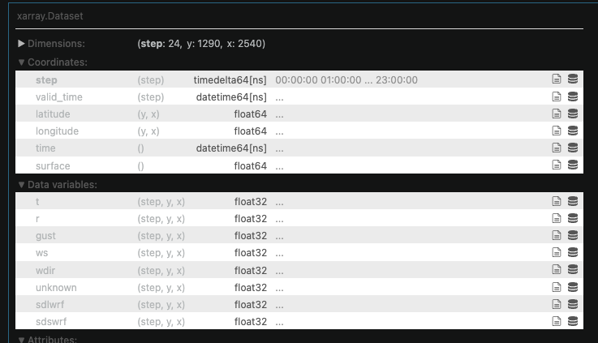
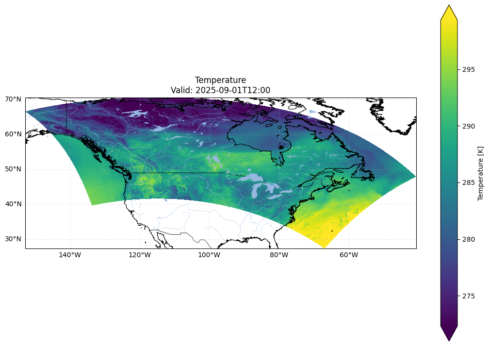

# HRDPS

## 1. Fir Alliance Download

Last updated: 16 Jul 2026

Connection details for Alliance / Fir (password and key paths) are kept in a **local-only** credentials file so they are not published with the site.

<!-- PRIVATE_CREDENTIALS -->

Explorer &amp; Downloader Notebook

<a href="file:///Users/machtl/Documents/Projects_Data/FirAliance%20download/fir_file_explorer.ipynb">/Users/machtl/Documents/Projects_Data/FirAliance download/fir_file_explorer.ipynb</a>

## 2. GRIB File Explorer

Last updated: 15 Jul 2026

Grib File Explorer Notebook

<a href="file:///Users/machtl/Documents/Projects_Data/FirAliance%20download/grib_explorer.ipynb">/Users/machtl/Documents/Projects_Data/FirAliance download/grib_explorer.ipynb</a>

xarray variables within a single day:

<strong>Figure 1.</strong> xarray dataset structure for a single HRDPS GRIB day, with dimensions step × y × x and surface variables (temperature, humidity, wind, radiation, etc.).

Example temperature plot:

<strong>Figure 2.</strong> Example HRDPS 2‑m temperature field (K) for valid time 2025-09-01 12:00 UTC over the continental domain.

### 2.1 Region Gribs

Last updated: 15 Jul 2026

This notebook clips full-domain HRDPS GRIB files down to the research-area polygons (Whistler, Rogers Pass, Banff, Mike Wiegele). The goal is **data reduction**: keep only the grid cells needed for each study area so later steps run on much smaller files.

Region Gribs Notebook

<a href="file:///Users/machtl/Documents/Projects_Data/FirAliance%20download/grib_clip_research_area.ipynb">/Users/machtl/Documents/Projects_Data/FirAliance download/grib_clip_research_area.ipynb</a>

## 3. Single Location to SMET

Last updated: 15 Jul 2026

GRIB file from archive downloaded → extract a single point → convert to SMET file.

Single Location to SMET Notebook

<a href="file:///Users/machtl/Documents/Projects_Data/FirAliance%20download/grib_single_location.ipynb">/Users/machtl/Documents/Projects_Data/FirAliance download/grib_single_location.ipynb</a>

## 4. DEM Analysis

Last updated: 15 Jul 2026

DEM Analysis Notebook

<a href="file:///Users/machtl/Documents/Projects_Data/DEM/explore_dem_topography.ipynb">/Users/machtl/Documents/Projects_Data/DEM/explore_dem_topography.ipynb</a>

HRDPS orography for the four study areas:

<strong>Figure 3.</strong> HRDPS orography (elevation, m) clipped to the four operation polygons: Whistler Blackcomb Heliskiing, Rogers Pass, Banff, and Mike Wiegele Heliskiing.

Elevation bands (below treeline / treeline / alpine):

<strong>Figure 4.</strong> Elevation-band classification within each operation polygon (below treeline, treeline ±100 m, alpine) using site-specific treeline heights.

Hypsometry inside operation polygons:

<strong>Figure 5.</strong> Hypsometry (grid-cell counts by 200 m elevation band) inside the four operation polygons, coloured by treeline class.

<strong>Table 1.</strong> Summary statistics of HRDPS grid cells inside each operation polygon, including elevation range, treeline definition, and area fractions below / at / above treeline.

| region | n_cells | area_km2_approx | z_min | z_median | z_mean | z_max | treeline_m | treeline_band_m | n_below | n_treeline | n_alpine | frac_below | frac_treeline | frac_alpine | area_below_km2 | area_treeline_km2 | area_alpine_km2 |
|--------|--------:|----------------:|------:|---------:|-------:|------:|-----------:|-----------------|--------:|-----------:|---------:|-----------:|--------------:|------------:|---------------:|------------------:|----------------:|
| Whistler Blackcomb Heliskiing | 284 | 1775 | 730 | 1777 | 1730 | 2340 | 1900 | 1800–2000 | 149 | 83 | 52 | 52.5% | 29.2% | 18.3% | 931 | 519 | 325 |
| Rogers Pass | 212 | 1325 | 1255 | 1872 | 1885 | 2678 | 2100 | 2000–2200 | 140 | 39 | 33 | 66.0% | 18.4% | 15.6% | 875 | 244 | 206 |
| Banff | 437 | 2731 | 1452 | 2180 | 2135 | 2695 | 2300 | 2200–2400 | 229 | 138 | 70 | 52.4% | 31.6% | 16.0% | 1431 | 862 | 438 |
| Mike Wiegele Heliskiing | 729 | 4556 | 715 | 1638 | 1611 | 2524 | 2100 | 2000–2200 | 628 | 71 | 30 | 86.1% | 9.7% | 4.1% | 3925 | 444 | 188 |

### Summary

This DEM analysis clips HRDPS orography to the four operation polygons and classifies each grid cell as below treeline, treeline (±100 m), or alpine using site-specific treeline heights (Whistler 1900 m, Rogers Pass / MWHS 2100 m, Banff 2300 m).

**Terrain character**

- **Mike Wiegele** is the largest domain (~4556 km², 729 cells) and the lowest: median elevation 1638 m, with **86%** of cells below treeline and only ~4% alpine.
- **Banff** is the highest: median 2180 m, treeline band 2200–2400 m, and the strongest alpine/treeline footprint among the four (alpine ~16%, treeline ~32%).
- **Rogers Pass** sits mid–high (median 1872 m) but is still mostly below treeline (**66%**); peaks reach ~2680 m.
- **Whistler Blackcomb** spans a wide elevation range (730–2340 m) with a more balanced split: ~53% below, ~29% treeline, ~18% alpine.

**Takeaway for AvaPro / snowpack work:** the four sites sample different snow climates and elevation mixes. MWHS is dominated by forested elevations; Banff and Whistler retain substantial treeline–alpine terrain where alpine slab problems are more relevant; Rogers Pass is intermediate but still majority below treeline in the HRDPS grid. Treeline definition strongly controls the band fractions, so results should be read relative to the chosen treeline heights above.

## 5. Local HRDPS to Single Location Elevation Corrected

Last updated: 22 Jul 2026

We built a single-point HRDPS→SMET pipeline that, for four reference stations (Whistler Rendezvous 1920 m, Bow Summit 2040 m, Fidelity 1905 m, MWHS 1900 m), finds the nearest HRDPS grid cell by lat/lon only, extracts season-long meteorology from the daily GRIBs in [`/Volumes/Machtl_1.1/HRDPS/2026`](file:///Volumes/Machtl_1.1/HRDPS/2026), and writes elevation-corrected SMETs to [`/Volumes/Machtl_1.1/SMET/single_points/`](file:///Volumes/Machtl_1.1/SMET/single_points/) using `grib2smet`: TA/RH are lapse-adjusted with `dz_hr = z_station − z_HRDPS`, where model orography is taken once from `HRDPS_DEM.grib2` at that same cell.

Single-Point HRDPS→SMET (Elevation Corrected) Notebook

<a href="file:///Users/machtl/Documents/Projects_Data/DEM/extract_single_point_HRDPS_to_SMET_elevation_corrected.ipynb">/Users/machtl/Documents/Projects_Data/DEM/extract_single_point_HRDPS_to_SMET_elevation_corrected.ipynb</a>

