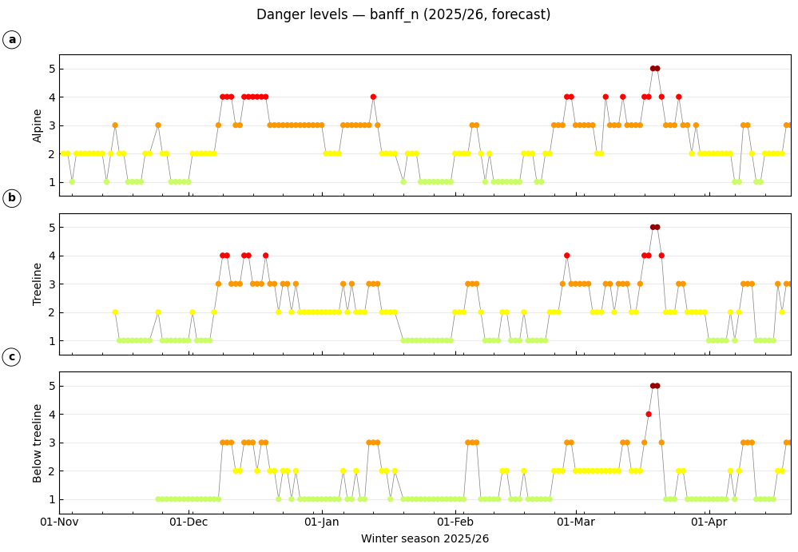

# Info ex

Last updated: 15 Jul 2026

InfoEx Notebooks

<a href="file:///Users/machtl/Documents/infoex/infoex_tools/notebooks">/Users/machtl/Documents/infoex/infoex_tools/notebooks</a>

Downloaded data

<a href="file:///Users/machtl/Documents/infoex/infoex_tools/notebooks/outputs">/Users/machtl/Documents/infoex/infoex_tools/notebooks/outputs</a>

## 1. Dangerlevels overview

Last updated: 15 Jul 2026

Danger Levels by Elevation Notebook

<a href="file:///Users/machtl/Documents/infoex/infoex_tools/notebooks/danger_levels_by_elevation.ipynb">/Users/machtl/Documents/infoex/infoex_tools/notebooks/danger_levels_by_elevation.ipynb</a>

<strong>Figure 1.</strong> Forecast avalanche danger levels for Banff North (banff_n) over winter 2025/26, shown separately for alpine, treeline, and below treeline.

## 2. Avalanche problems

Last updated: 15 Jul 2026

