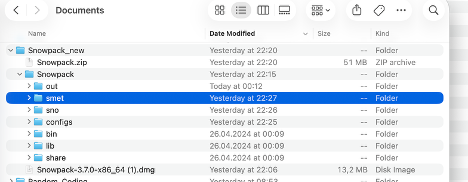

# SNOWPACK

<p class="section-updated">Last updated: 19 Jul 2026</p>

## 1. SLF Stand Alone Version

<p class="section-updated">Last updated: 19 Jul 2026</p>

<details class="table-dropdown">
<summary><strong>2.1 Initial Install Based on Released Version</strong> — click to expand</summary>

Standalone SNOWPACK builds from WSL / SLF:

<div class="note-box">
<p class="note-box__title">Snowpack Stand Alone Releases</p>
<div class="note-box__body">
<a href="https://code.wsl.ch/snow-models/snowpack/-/releases" target="_blank" rel="noopener">https://code.wsl.ch/snow-models/snowpack/-/releases</a>
</div>
</div>

#### Install

1. Download code (`*.tar`, `*.dmg`, or `*.exe`) for your platform from the releases page above.
2. Install SNOWPACK — a folder `/Snowpack` is created.
3. **macOS:** allow SNOWPACK under **System Settings → Privacy & Security** (repeat for libraries as requested).

#### Input Files

| File | Role |
|------|------|
| `.ini` | Model settings |
| `.smet` | Meteorological input |
| `.sno` | Snow-profile / snow-cover state and meta information |

#### Preparations

- Copy working folders into `/path-to-folder/Snowpack/`: `configs`, `smet`, `sno`
- Create output folder `/path-to-folder/Snowpack/out`
- Edit the run `.ini` (e.g. `./configs/snp_axliz_aws.ini`):
  - `[Input]` → `METEOPATH` (path to `/smet`) and `SNOWPATH` (path to `/sno`)
  - `[Output]` → `METEOPATH` (path to `/out`)

#### Visualize Output

- Profile / layer output: open https://run.niviz.org and load the `.pro` file from `/out` (e.g. `AXLIZ-AWS.pro`)
- Time series: open the corresponding `.smet` file in `/out`

#### Additional Info (ACINN Lecture)

<div class="note-box">
<p class="note-box__title">ACINN Lecture Slides (Install &amp; Run)</p>
<div class="note-box__body">
<p>Additional stand-alone install / run notes: pages 44–56.</p>
<a href="file:///Users/machtl/Library/CloudStorage/OneDrive-SimonFraserUniversity(1sfu)/Presentations/lectures/ACINN/Lectures/2024-12-10-LectureOnSnowCoverModeling/Slides/VU-SnowCoverModelling-TheoryAndPractice.pdf">/Users/machtl/Library/CloudStorage/OneDrive-SimonFraserUniversity(1sfu)/Presentations/lectures/ACINN/Lectures/2024-12-10-LectureOnSnowCoverModeling/Slides/VU-SnowCoverModelling-TheoryAndPractice.pdf</a>
</div>
</div>

</details>

### 2.2 Already Installed Locally

<p class="section-updated">Last updated: 19 Jul 2026</p>



<p class="fig-caption"><strong>Figure 1.</strong> Example local install folder (<code>Snowpack_new/Snowpack</code>) with <code>bin</code>, <code>configs</code>, <code>smet</code>, <code>sno</code>, and <code>out</code>.</p>

Copy-paste terminal (replace `/path-to-folder` with your install path):

```bash
cd /path-to-folder/Snowpack/
cd bin
./snowpack -c ../configs/snp_axliz_aws.ini -e 2024-06-01T00:00:00
```

<details class="table-dropdown">
<summary><strong>2.3 SLF — Git Master Branch Version</strong> — click to expand</summary>

<p class="section-updated">Last updated: 19 Jul 2026</p>

Self-contained build of **SNOWPACK** and **MeteoIO** from the current GitLab `master` branches (not the released 3.7.0 DMG), rooted at `snowpack_vGitMaster`.

| Item | Path / value |
|------|----------------|
| Root | [`/Users/machtl/Documents/snowpack_vGitMaster/`](file:///Users/machtl/Documents/snowpack_vGitMaster/) |
| Snowpack source | `…/snowpack/` ([gitlabext.wsl.ch/snow-models/snowpack](https://gitlabext.wsl.ch/snow-models/snowpack)) |
| MeteoIO source | `…/meteoio/` ([gitlabext.wsl.ch/snow-models/meteoio](https://gitlabext.wsl.ch/snow-models/meteoio)) |
| Install prefix | `…/install/` |
| Helper env script | `…/env.sh` |

**Do not confuse with** the released DMG install under [`/Users/machtl/Documents/Snowpack_new/`](file:///Users/machtl/Documents/Snowpack_new/) (Snowpack 3.7.0, Apr 2024). That tree was left unchanged.

#### What Was Installed

Built and verified on **2026-07-19** (macOS, Apple Clang, CMake):

`Snowpack version 20260719.8e81d05` · `Libsnowpack 20260719.8e81d05` · `MeteoIO 20260719.8efb7964`

- Snowpack commit: `8e81d05` (git-describe style: `Snowpack-3.7.0-291-g…` — commits **after** the 3.7.0 tag)
- MeteoIO commit: `8efb7964` (`test-224-g8efb7964`)

Binaries / libraries:

- `install/bin/snowpack`
- `install/bin/meteoio_timeseries`
- `install/lib/libsnowpack*.dylib`
- `install/lib/libmeteoio*.dylib`
- Headers under `install/include/`
- Docs / Inishell XML under `install/share/doc/`

#### Directory Layout

```text
snowpack_vGitMaster/
├── env.sh          # source this to put binaries on PATH
├── install/        # compiled install prefix
│   ├── bin/
│   ├── lib/
│   ├── include/
│   └── share/
├── meteoio/        # MeteoIO git clone (master)
│   └── build/      # CMake build tree
└── snowpack/       # Snowpack git clone (master)
    └── build/      # CMake build tree
```

Sibling folder names `meteoio` and `snowpack` match WSL’s recommended layout so CMake can find MeteoIO as a neighbor / via `CMAKE_PREFIX_PATH`.

#### How to Run

```bash
source /Users/machtl/Documents/snowpack_vGitMaster/env.sh
snowpack -v
snowpack -c /path/to/config.ini -e NOW
```

Or call the binary with an absolute path (still set the library path if needed):

```bash
export DYLD_FALLBACK_LIBRARY_PATH="/Users/machtl/Documents/snowpack_vGitMaster/install/lib:$DYLD_FALLBACK_LIBRARY_PATH"
/Users/machtl/Documents/snowpack_vGitMaster/install/bin/snowpack -c /path/to/config.ini -e NOW
```

`env.sh` conceptually:

- Prepends `install/bin` to `PATH`
- Prepends `install/lib` to `DYLD_FALLBACK_LIBRARY_PATH`
- Prints a short `snowpack -v` check

#### Rebuild From Scratch (Reproduce)

Prerequisites: Xcode Command Line Tools (`clang++`), CMake, make, network access to WSL GitLab.

```bash
ROOT="/Users/machtl/Documents/snowpack_vGitMaster"
PREFIX="$ROOT/install"
mkdir -p "$ROOT"
cd "$ROOT"

git clone --branch master --single-branch \
  https://gitlabext.wsl.ch/snow-models/meteoio.git meteoio
git clone --branch master --single-branch \
  https://gitlabext.wsl.ch/snow-models/snowpack.git snowpack

# --- MeteoIO ---
cd "$ROOT/meteoio"
rm -rf build && mkdir build && cd build
cmake .. -DCMAKE_BUILD_TYPE=Release -DCMAKE_INSTALL_PREFIX="$PREFIX"
cmake --build . -j"$(sysctl -n hw.ncpu)"
cmake --install .

# macOS quirk: upstream may install apps/libs to $ROOT/MacOS instead of $PREFIX/{bin,lib}
if [ -d "$ROOT/MacOS" ]; then
  mkdir -p "$PREFIX/bin" "$PREFIX/lib"
  find "$ROOT/MacOS" -maxdepth 1 -name 'lib*.dylib*' -exec mv {} "$PREFIX/lib/" \;
  find "$ROOT/MacOS" -maxdepth 1 -type f -perm +111 ! -name 'lib*' -exec mv {} "$PREFIX/bin/" \;
  rm -rf "$ROOT/MacOS"
fi

# Fallback: copy from in-tree outputs if needed
if [ ! -f "$PREFIX/lib/libmeteoio.dylib" ] && [ -f "$ROOT/meteoio/lib/libmeteoio.dylib" ]; then
  mkdir -p "$PREFIX/lib" "$PREFIX/bin"
  cp -R "$ROOT/meteoio/lib/"* "$PREFIX/lib/"
  cp "$ROOT/meteoio/bin/meteoio_timeseries" "$PREFIX/bin/"
fi

# --- Snowpack ---
cd "$ROOT/snowpack"
rm -rf build && mkdir build && cd build
cmake .. -DCMAKE_BUILD_TYPE=Release \
  -DCMAKE_INSTALL_PREFIX="$PREFIX" \
  -DCMAKE_PREFIX_PATH="$PREFIX"
cmake --build . -j"$(sysctl -n hw.ncpu)"
cmake --install .

if [ -d "$ROOT/MacOS" ]; then
  mkdir -p "$PREFIX/bin" "$PREFIX/lib"
  find "$ROOT/MacOS" -maxdepth 1 -name 'lib*.dylib*' -exec mv {} "$PREFIX/lib/" \;
  find "$ROOT/MacOS" -maxdepth 1 -type f -perm +111 ! -name 'lib*' -exec mv {} "$PREFIX/bin/" \;
  rm -rf "$ROOT/MacOS"
fi

if [ ! -f "$PREFIX/bin/snowpack" ] && [ -f "$ROOT/snowpack/bin/snowpack" ]; then
  mkdir -p "$PREFIX/bin" "$PREFIX/lib"
  cp "$ROOT/snowpack/bin/snowpack" "$PREFIX/bin/"
  cp -R "$ROOT/snowpack/lib/"* "$PREFIX/lib/"
fi

# Verify
export PATH="$PREFIX/bin:$PATH"
export DYLD_FALLBACK_LIBRARY_PATH="$PREFIX/lib:$DYLD_FALLBACK_LIBRARY_PATH"
snowpack -v
```

Equivalent remotes (same projects): `https://code.wsl.ch/snow-models/...`

#### Update to Newer Master

```bash
ROOT="/Users/machtl/Documents/snowpack_vGitMaster"
PREFIX="$ROOT/install"

cd "$ROOT/meteoio" && git pull --ff-only origin master
cd "$ROOT/snowpack" && git pull --ff-only origin master

# Then rebuild both (same cmake/build/install steps as above),
# MeteoIO first, then Snowpack.
```

#### Dependencies

| Dependency | Required? |
|------------|-----------|
| MeteoIO (master) | Yes — only hard library dependency |
| CMake + C++ toolchain | Yes |
| Inishell | No (ini GUI) |
| niViz | No (viewer) |
| NetCDF / PROJ / DB plugins | No for typical SMET point simulations |

#### Notes

- **Release vs master:** The DMG is frozen 3.7.0. This build is git `master`. Version strings may still mention 3.7.x because tagging continues from that line; the **git hash** is the truth.
- **macOS install paths:** WSL CMake on Apple often installs binaries into a `MacOS/` folder next to the prefix. After `cmake --install`, move libraries into `install/lib` and executables into `install/bin` (as done above).
- **Configs / data:** This tree does not include station `configs/`, `smet/`, or `sno/` from `Snowpack_new`. Point `-c` at an ini whose paths you control, or copy configs into a working directory outside the DMG tree if you want to keep them separate.
- **Library loading on macOS:** Prefer `DYLD_FALLBACK_LIBRARY_PATH` (as in `env.sh`) rather than relying only on system paths.

#### Quick Checks

```bash
source /Users/machtl/Documents/snowpack_vGitMaster/env.sh
which snowpack
# → …/snowpack_vGitMaster/install/bin/snowpack

snowpack -v
# → Snowpack version 20260719.8e81d05 (or newer after rebuild)
#    MeteoIO 20260719.8efb7964 (or newer)

git -C /Users/machtl/Documents/snowpack_vGitMaster/snowpack log -1 --oneline
git -C /Users/machtl/Documents/snowpack_vGitMaster/meteoio log -1 --oneline
```

</details>

### 2.4 Stand Alone Mode for ISSW2026

<p class="section-updated">Last updated: 19 Jul 2026</p>

The binary can stay in `snowpack_vGitMaster`; only the run assets need to live in the ISSW2026 run directory.

Laid out as:

```text
SNP_runs_for_ISSW26/
  config/          # inis (template + site)
  smet/2025/       # forcing
  sno/2025/        # initial profiles
  out/2025/        # outputs
  run_snowpack.sh  # calls the external binary
```

Paths in `config/snp_Rendezvous25_nwp.ini` now point into this project. Smoke-tested a 2-day run — worked; outputs landed in `out/2025/`.

Run it:

```bash
cd /Users/machtl/Documents/Projects_PhD/SNP_runs_for_ISSW26
./run_snowpack.sh
# or
./run_snowpack.sh config/snp_Rendezvous25_nwp.ini 2025-05-31T23:00:00
```

#### Simulations Inputs

##### .sno Files

| | slope angle | Slope azimut | apprev |
|---|------------:|-------------:|--------|
| flat | 0 | n.a. | .sno |
| north | 38 | 0 | 1.sno |
| northeast | 38 | 45 | 2.sno |
| East | 38 | 90 | 3.sno |
| Southeast | 38 | 135 | 4.sno |
| South | 38 | 180 | 5.sno |
| Southwest | 38 | 225 | 6.sno |
| West | 38 | 270 | 7.sno |
| Northwest | 38 | 315 | 8.sno |

Example `.sno` file (header; empty snowpack at start):

```text
SMET 1.1 ASCII
[HEADER]
station_id       = Whistler_Rendezvous_HRDPS_2026
station_name     = Studyplot
latitude         = 50.09567
longitude        = -122.901022
altitude         = 1429
nodata           = -999
tz               = 0
source           = NWP
ProfileDate      = 2025-09-02T00:00:00
HS_Last          = 0.0000
SlopeAngle       = 0
SlopeAzi         = 0
nSoilLayerData   = 0
nSnowLayerData   = 0
SoilAlbedo       = 0.09
BareSoil_z0      = 0.200
CanopyHeight     = 0.00
CanopyLeafAreaIndex     = 0.00
CanopyDirectThroughfall = 1.00
WindScalingFactor       = 1.0
ErosionLevel     = 0
TimeCountDeltaHS = 0.000000
fields           = timestamp Layer_Thick  T  Vol_Frac_I  Vol_Frac_W  Vol_Frac_V  Vol_Frac_S Rho_S Conduc_S HeatCapac_S  rg  rb  dd  sp  mk mass_hoar ne CDot metamo
[DATA]
```

##### Config Files

<div class="note-box">
<p class="note-box__title">Config Folder</p>
<div class="note-box__body">
<a href="file:///Users/machtl/Documents/Projects_PhD/SNP_runs_for_ISSW26/config">/Users/machtl/Documents/Projects_PhD/SNP_runs_for_ISSW26/config</a>
</div>
</div>

<div class="note-box">
<p class="note-box__title">snp_Rendezvous26_nwp.ini</p>
<div class="note-box__body">
<a href="file:///Users/machtl/Documents/Projects_PhD/SNP_runs_for_ISSW26/config/snp_Rendezvous26_nwp.ini">/Users/machtl/Documents/Projects_PhD/SNP_runs_for_ISSW26/config/snp_Rendezvous26_nwp.ini</a>
</div>
</div>
