# Spatial Config

Last updated: 15 Jul 2026

This project investigates how different spatial sampling strategies influence avalanche problem identification and regional hazard assessment using distributed SNOWPACK simulations. By comparing multiple HRDPS grid configurations across four forecast regions in western Canada, the study evaluates their effects on the detection, spatial prevalence, and temporal evolution of avalanche problems, as well as their agreement with operational hazard assessments and observed avalanche activity. This documentation summarizes the project's methodology, implementation, analyses, and ongoing progress toward identifying representative and operationally useful simulation strategies.

Overleaf Paper Draft

<a href="https://www.overleaf.com/5937948778fmrynphxshsj#43b1cd" target="_blank" rel="noopener">https://www.overleaf.com/5937948778fmrynphxshsj#43b1cd</a>

## 1. Brainstorm Flowchart

Last updated: 16 Jul 2026

### Brainstorm Summary – Spatial Configurations for Distributed SNOWPACK Simulations

#### Research Question

The study is about understanding how the spatial representation of snowpack simulations influences the distribution of simulated instability and, consequently, the regional interpretation of avalanche problems.

**How does the spatial configuration of distributed snowpack simulations influence the simulated distribution of instability and the resulting identification and regional relevance of avalanche problems?**

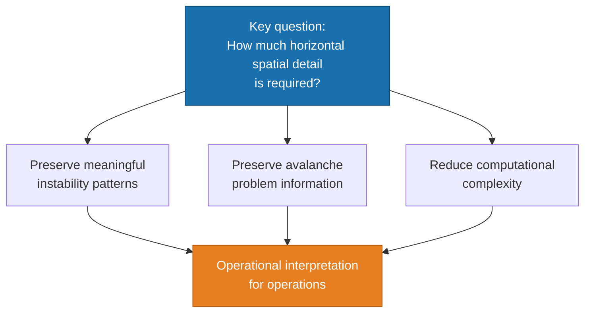

<strong>Figure A.</strong> Framing: spatial detail vs. operational meaning and computational cost.

#### Conceptual Framework

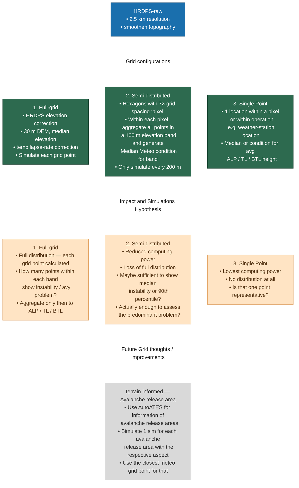

<strong>Figure B.</strong> From HRDPS-raw to three spatial configurations, impact / simulation hypotheses, and future grid thoughts.

| Configuration | Elevation Treatment |
|---------------|---------------------|
| 1 – Full-Grid | Representative elevation per HRDPS cell (30 m DEM, median) |
| 2 – Semi-Distributed | Representative elevation per 100 m band within each hexagon pixel |
| 3 – Single Point | Representative elevation (ALP / TL / BTL avg) for the chosen location |

#### Contribution

Frame the paper as a study of **spatial representation (or spatial sampling)** in distributed snowpack modelling, rather than a technical comparison of grid configurations.

Main contribution: understanding how different spatial representations influence the translation from distributed snowpack simulations to regional avalanche information.

## 2. Grid Configs

Last updated: 15 Jul 2026

### 2.1 Full Grid - HRDPS RAW DEM

Last updated: 15 Jul 2026

DEM Analysis Notebook

<a href="file:///Users/machtl/Documents/Projects_Data/DEM/explore_dem_topography.ipynb">/Users/machtl/Documents/Projects_Data/DEM/explore_dem_topography.ipynb</a>

Full HRDPS orography clipped to the four study areas (from HRDPS DEM analysis):

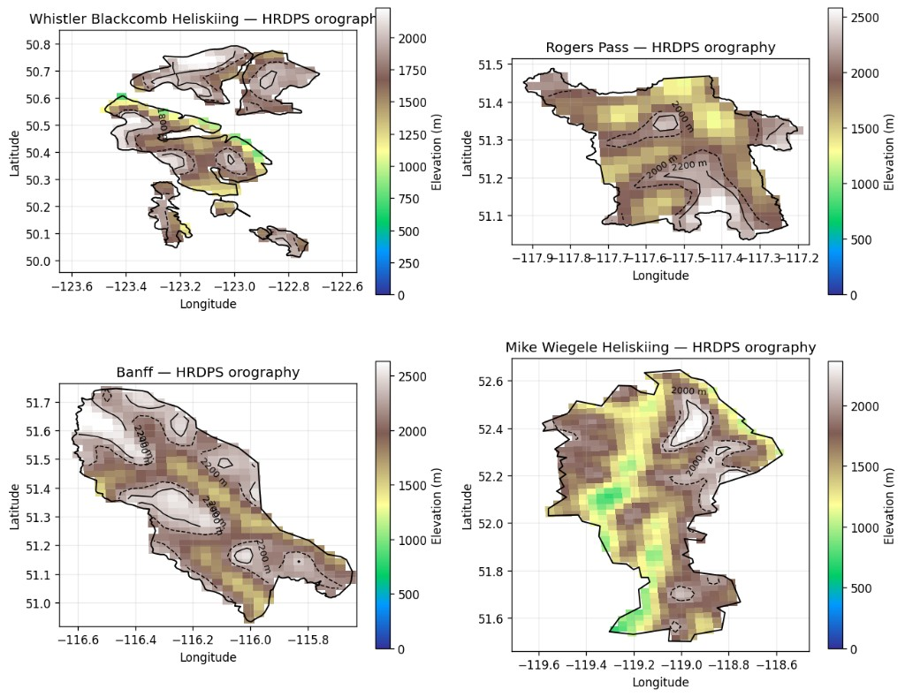

<strong>Figure 1.</strong> HRDPS orography (elevation, m) clipped to the four operation polygons: Whistler Blackcomb Heliskiing, Rogers Pass, Banff, and Mike Wiegele Heliskiing.

Elevation bands (below treeline / treeline / alpine):

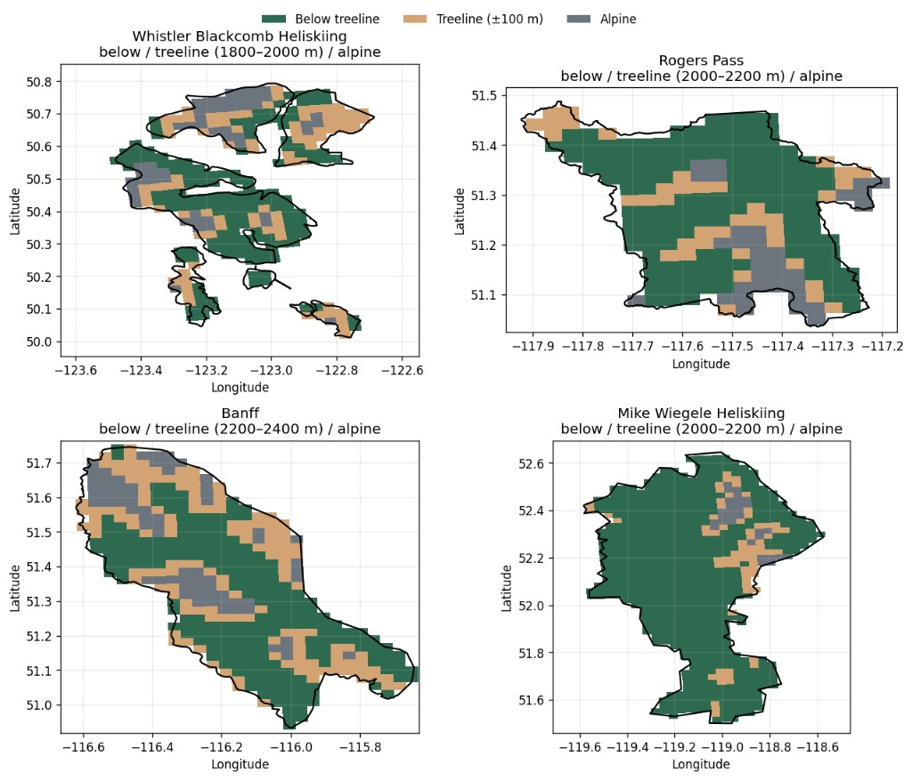

<strong>Figure 2.</strong> Elevation-band classification within each operation polygon (below treeline, treeline ±100 m, alpine) using site-specific treeline heights.

Hypsometry inside operation polygons:

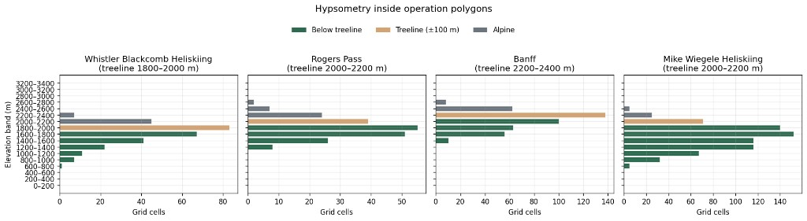

<strong>Figure 3.</strong> Hypsometry (grid-cell counts by 200 m elevation band) inside the four operation polygons, coloured by treeline class.

<strong>Table 1.</strong> Summary statistics of HRDPS grid cells inside each operation polygon (elevation range, treeline, area fractions)

| region | n_cells | area_km2_approx | z_min | z_median | z_mean | z_max | treeline_m | treeline_band_m | n_below | n_treeline | n_alpine | frac_below | frac_treeline | frac_alpine | area_below_km2 | area_treeline_km2 | area_alpine_km2 |
|--------|--------:|----------------:|------:|---------:|-------:|------:|-----------:|-----------------|--------:|-----------:|---------:|-----------:|--------------:|------------:|---------------:|------------------:|----------------:|
| Whistler Blackcomb Heliskiing | 284 | 1775 | 730 | 1777 | 1730 | 2340 | 1900 | 1800–2000 | 149 | 83 | 52 | 52.5% | 29.2% | 18.3% | 931 | 519 | 325 |
| Rogers Pass | 212 | 1325 | 1255 | 1872 | 1885 | 2678 | 2100 | 2000–2200 | 140 | 39 | 33 | 66.0% | 18.4% | 15.6% | 875 | 244 | 206 |
| Banff | 437 | 2731 | 1452 | 2180 | 2135 | 2695 | 2300 | 2200–2400 | 229 | 138 | 70 | 52.4% | 31.6% | 16.0% | 1431 | 862 | 438 |
| Mike Wiegele Heliskiing | 729 | 4556 | 715 | 1638 | 1611 | 2524 | 2100 | 2000–2200 | 628 | 71 | 30 | 86.1% | 9.7% | 4.1% | 3925 | 444 | 188 |

<strong>Table 2.</strong> Number of SNOWPACK simulations for the full-grid configuration (9 simulations per HRDPS cell)

| region | n_cells | snowpack simulations |
|--------|--------:|---------------------:|
| Whistler Blackcomb Heliskiing | 284 | 2556 |
| Rogers Pass | 212 | 1908 |
| Banff | 437 | 3933 |
| Mike Wiegele Heliskiing | 729 | 6561 |

Region Gribs Notebook

<a href="file:///Users/machtl/Documents/Projects_Data/FirAliance%20download/grib_clip_research_area.ipynb">/Users/machtl/Documents/Projects_Data/FirAliance download/grib_clip_research_area.ipynb</a>

HRDPS Raw Files (External Drive)

<a href="file:///Volumes/Machtl_1.1/HRDPS_clipped">/Volumes/Machtl_1.1/HRDPS_clipped</a>

### 2.2 Full Grid - Elevation Corrected

Last updated: 16 Jul 2026

- HRDPS elevation correction using 30 m DEM (median elevation)

Download 30 m DEM

<a href="file:///Users/machtl/Documents/Projects_Data/DEM/download_mrdem30_for_research_areas.ipynb">/Users/machtl/Documents/Projects_Data/DEM/download_mrdem30_for_research_areas.ipynb</a>

- Temperature lapse-rate correction
- Simulate each grid point

#### 2.2.1 30m DEM Topo

Last updated: 16 Jul 2026

MRDEM-30 orography clipped to the four study areas:

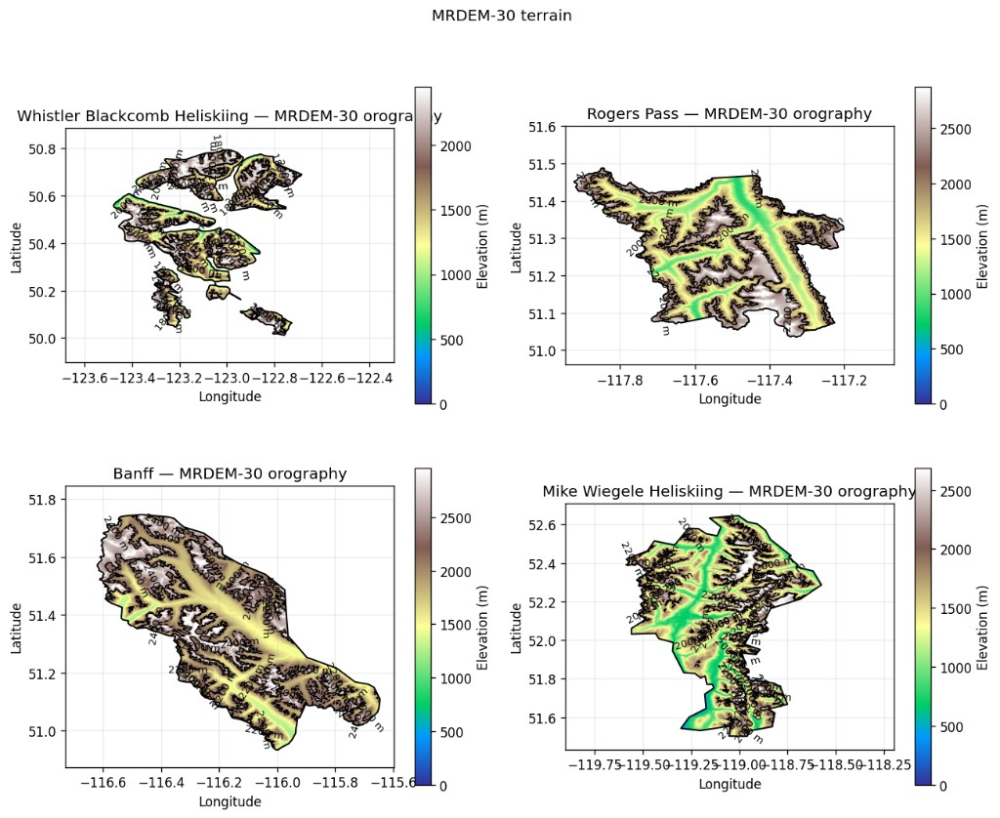

<strong>Figure 4.</strong> MRDEM-30 orography (elevation, m) clipped to the four operation polygons: Whistler Blackcomb Heliskiing, Rogers Pass, Banff, and Mike Wiegele Heliskiing.

Elevation bands (below treeline / treeline / alpine):

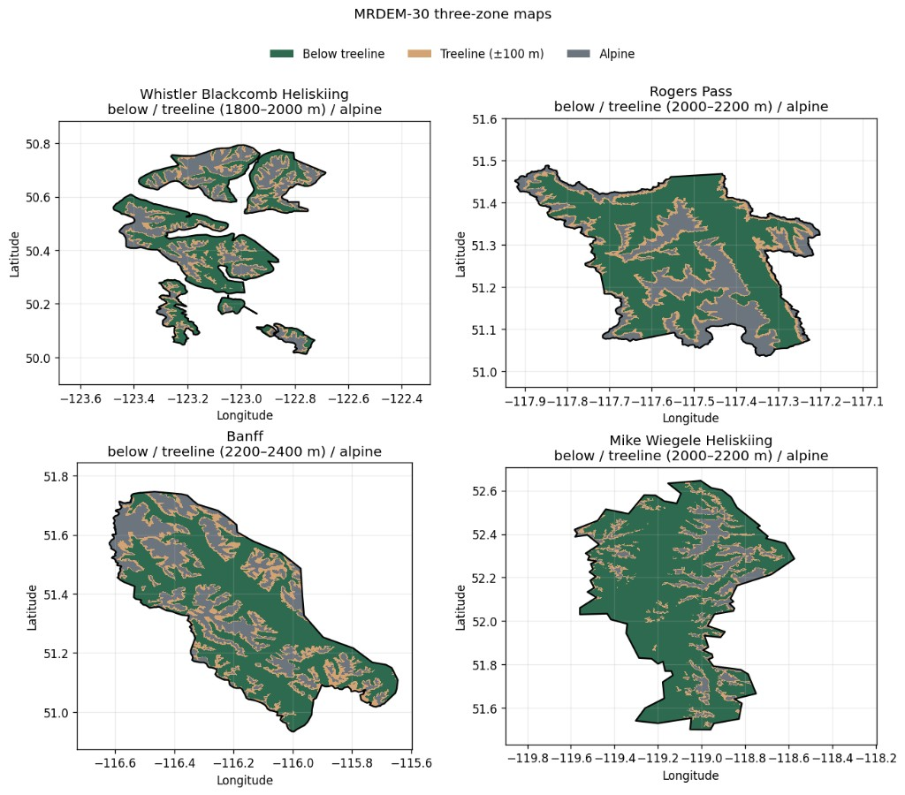

<strong>Figure 5.</strong> MRDEM-30 elevation-band classification within each operation polygon (below treeline, treeline ±100 m, alpine) using site-specific treeline heights.

Hypsometry inside operation polygons:

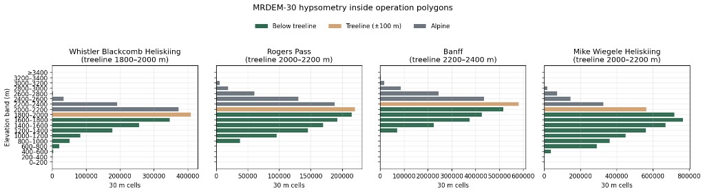

<strong>Figure 6.</strong> MRDEM-30 hypsometry (30 m cell counts by 200 m elevation band) inside the four operation polygons, coloured by treeline class.

#### 2.2.2 HRDPS Topo to 30m DEM

Last updated: 16 Jul 2026

Map HRDPS topography onto the 30 m DEM (median elevation per HRDPS cell) for elevation-corrected full-grid simulations.

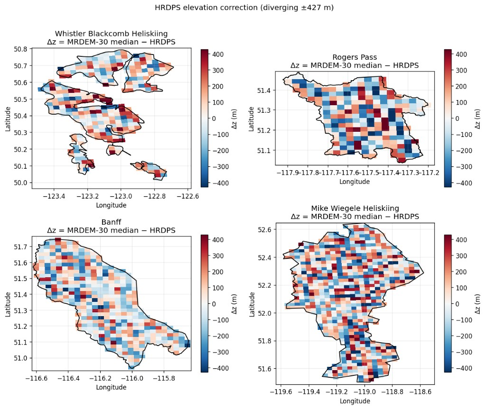

<strong>Figure 7.</strong> HRDPS elevation correction Δz = MRDEM-30 cell median − HRDPS elevation (m) for the four operation polygons (diverging scale ±427 m).

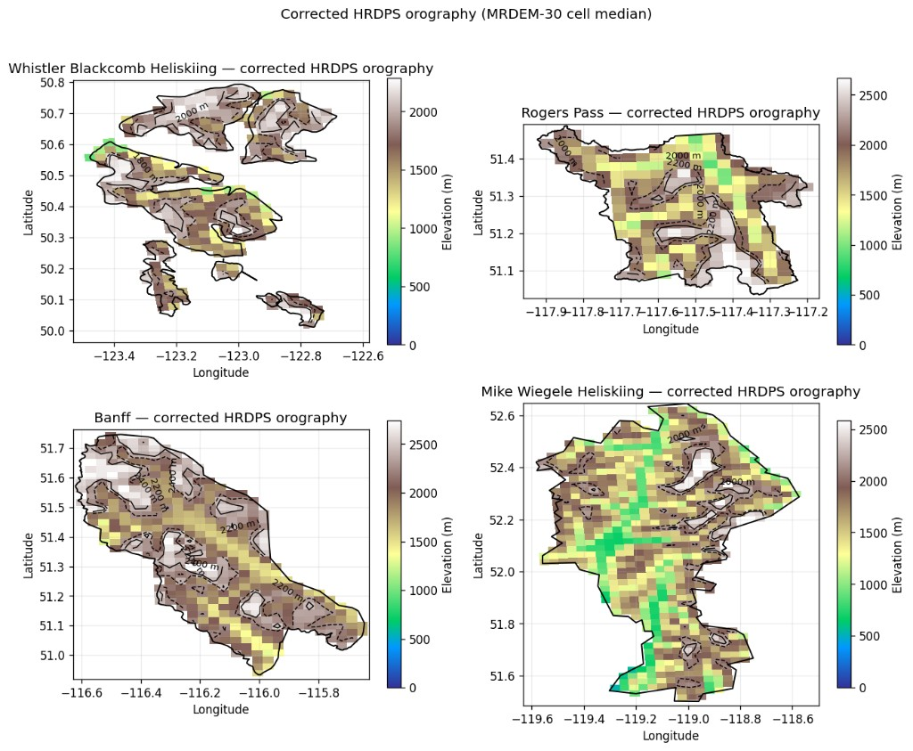

<strong>Figure 8.</strong> Corrected HRDPS orography (elevation, m) using the MRDEM-30 cell-median elevation for each HRDPS grid cell.

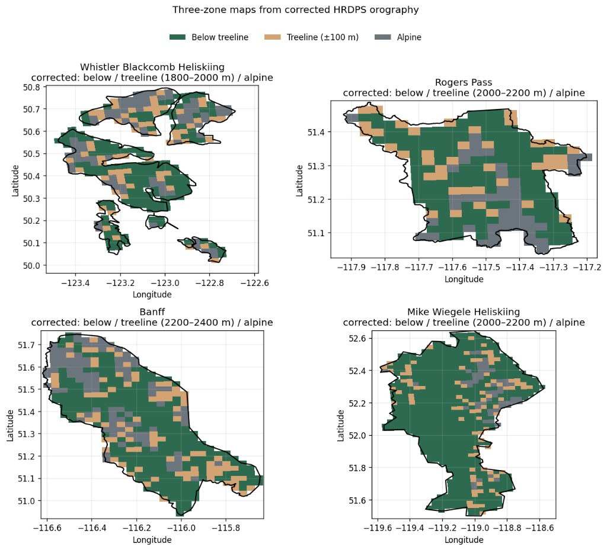

<strong>Figure 9.</strong> Three-zone classification (below treeline / treeline ±100 m / alpine) from corrected HRDPS orography, using site-specific treeline heights.

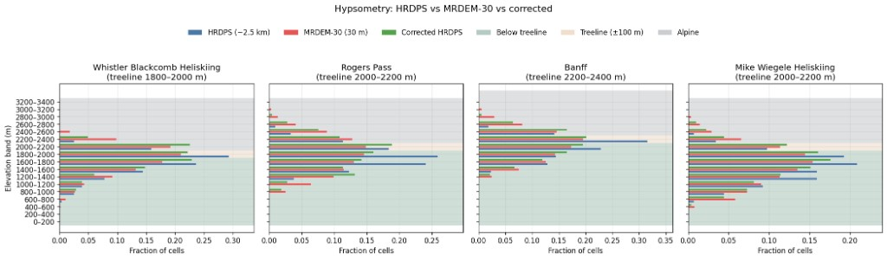

<strong>Figure 10.</strong> Hypsometry comparison: raw HRDPS, MRDEM-30, and corrected HRDPS as fraction of cells by 200 m elevation band, with site-specific below-treeline / treeline / alpine shading.

Next to do's — Spatial Config › 2.2.2 HRDPS Topo to 30m DEM

<ul>
<li>define elevation correction workflow</li>
<li>run simulations</li>
</ul>

### 2.3 Semi Distributed

Last updated: 16 Jul 2026

- **Downscale** onto a coarser spatial unit (hexagon aggregation)
- Hexagons with ~7× grid spacing (“pixel”)
- Within each pixel: aggregate all points in a 100 m elevation band → Median Meteo
- Only simulate every 200 m
- **Temperature:** CanHydro / Pomeroy-style lapse rate
- **Precipitation:** no lapse / adjustment yet
- **Open question:** is there actually variability across aggregated units?

Next to do's — Spatial Config › 2.3 Semi Distributed

<ul>
<li>define strategy</li>
</ul>

### 2.4 Single Point

Last updated: 16 Jul 2026

- 1 location within a pixel or within the operation (e.g. weather-station location)
- Median or condition for average ALP / TL / BTL height
- Lowest computing power; no spatial distribution

Next to do's — Spatial Config › 2.4 Single Point

<ul>
<li>choose representative points</li>
<li>run simulations</li>
</ul>

### 2.5 Terrain Informed Grid

Last updated: 15 Jul 2026

For the terrain-informed grid we will use avalanche release areas from **autoATES v3** (PRA model output) to sample HRDPS / SNOWPACK points in likely start-zone terrain rather than every grid cell.

Below: mail from John:

<em>Hey Martin,</em>

<em>I would be happy to provide the PRA model output for your analysis. Are you working in a specific study area?</em>

<em>I've been doing a lot of development work on the autoATESv3.0 model the past couple weeks and have made some significant changes to the PRA model output. The biggest change is that I now output two scenarios, one that captures frequent start zones and one for extreme start zones. The frequent ones are targeted at the most likely release areas based on slope angle, forest cover, and wind shelter. The extreme ones include lower angle slopes and start zones in more forested areas. So, depending on how broad of a net you want to cast, you could select one or the other of these scenarios. The frequent scenario would be better for narrowing down the location of the most common start zone locations within the terrain.</em>

<em>The other major change is that the PRA models outputs polygons for individual start zones for each scenario. This might not be useful for you if you just want to know the location of potential start zones. The polygons are mostly useful for narrowing down the potential size of start zones and assessing the relative likelihood of each polygon being a start zone. Declan and I are using this to identify the most likely release areas from BC MOT control paths and it has been pretty useful.</em>

<em>The PRA model runs fairly quickly, so I should be able to run it for you in your study area. I haven't run the PRA model for all the AvCan forecast zones yet, still waiting to finalize the validation work before running it on large scales.</em>

<em>Cheers, John</em>

Next to do's — Spatial Config › 2.5 Terrain Informed Grid

<ul>
<li>get johns maps</li>
<li>choose grid strategie</li>
<li>run sim</li>
</ul>

